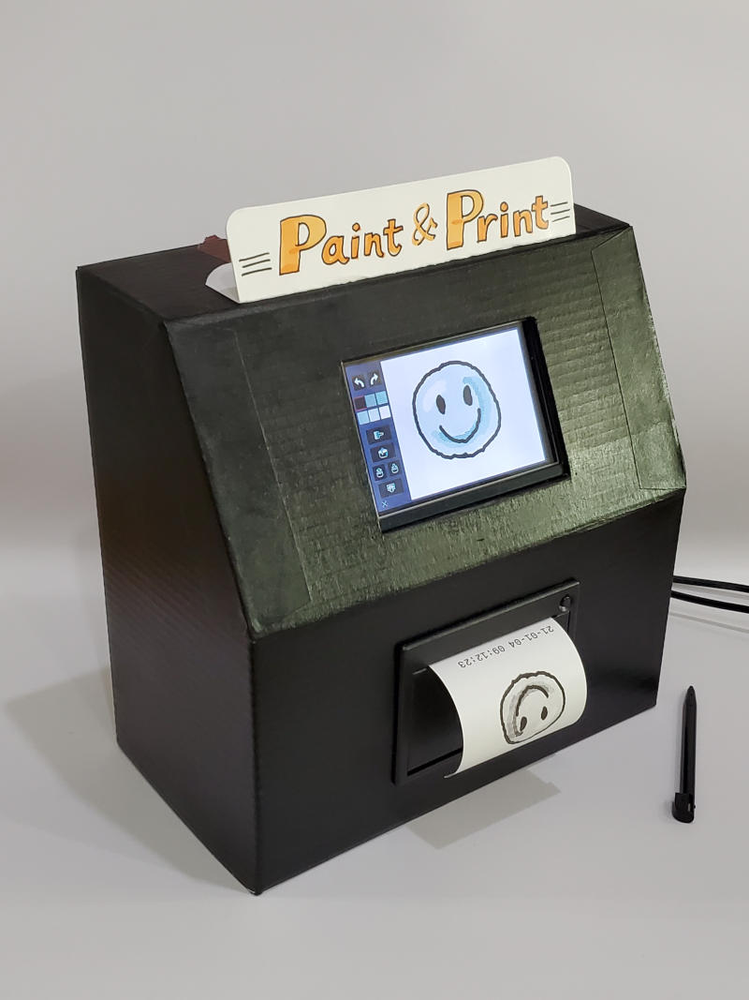

# Paint-Print-Station
A paint and print station for Raspberry Pi with 3.5inch touch screen and thermal printer.

# Dependance
* Pygame

# Running method
```
python paint_station.py
```



# Configuration
If you want to use python-escpos lib to print paints, change this line in [paint_station_config.ini](paint_station_config.ini):
```
use_escpos = 1
```
and modify [paint_station_print.py](paint_station_print.py) according to your thermal printer configuration.

If you set:
```
use_escpos = 0
```
it will use 'lp' command to print paints by these configrations in [paint_station_config.ini](paint_station_config.ini):
```
print_command = lp -d Zijiang-ZJ-58 -o orientation-requested=3 __filename__
print_info_command = echo __datetime__ | lp -d Zijiang-ZJ-58 
```

If you don't need print function, just remove these three lines in [paint_station_config.ini](paint_station_config.ini):
```
use_escpos = 0
print_command = lp -d Zijiang-ZJ-58 -o orientation-requested=3 __filename__
print_info_command = echo __datetime__ | lp -d Zijiang-ZJ-58 
```
